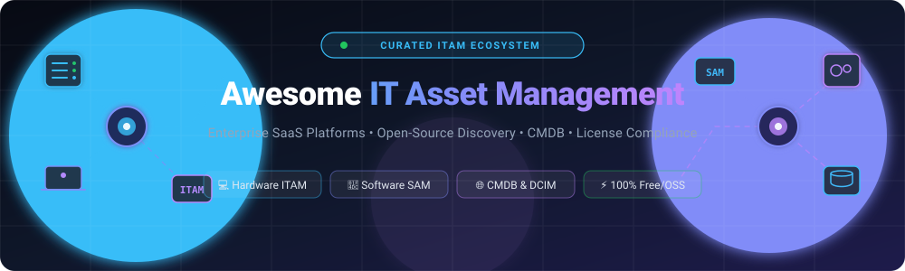

<p align="center">
  
</p>

<p align="center">
  <a href="https://github.com/ishandutta2007/Awesome-Awesome-Awesome"></a>
  <a href="https://discord.gg/jc4xtF58Ve"></a>
  <a href="https://github.com/ishandutta2007/Awesome-IT-Asset-Management/stargazers"></a>
  <a href="https://github.com/ishandutta2007/Awesome-IT-Asset-Management/network/members"></a>
  <a href="https://github.com/ishandutta2007/Awesome-IT-Asset-Management/pulls"></a>
  <a href="https://github.com/ishandutta2007/Awesome-IT-Asset-Management/blob/main/LICENSE"></a>
  <a href="https://github.com/ishandutta2007"></a>
</p>

---

# 💻 Awesome IT Asset Management (ITAM) 🚀

> **A curated landscape of premier SaaS platforms, enterprise commercial tools, and open-source GitHub projects for IT Asset Management (ITAM), Software Asset Management (SAM), Hardware Asset Management (HAM), CMDB, and Discovery.**

📅 **Last updated: September 2026**

---

## 📖 Table of Contents

- [📊 Market Overview & Sizing](#-market-overview--sizing)
- [🏢 SaaS & Commercial Platforms](#-saas--commercial-platforms)
- [⚡ Open-Source GitHub Projects](#-open-source-github-projects)
- [🛠️ Open-Source Ecosystem Stacks](#️-open-source-ecosystem-stacks)
- [⭐ Star History](#-star-history)
- [🤝 How to Contribute](#-how-to-contribute)
- [⚠️ Disclaimer](#️-disclaimer)

---

## 📊 Market Overview & Sizing

> [!NOTE]
> 📈 **Market Sizing & Dynamics**: The global **IT Asset Management (ITAM)** software market is estimated at **$2.5B – $4.7B in 2026** and projected to grow at a **6.0% – 8.5% CAGR** through 2032. The sector is **moderately fragmented**: category leaders (such as *ServiceNow* and *Flexera*) control ~35%–40% market share through unified ITSM/FinOps ecosystems, while the remaining ~60% of the market is powered by specialized mid-market solutions (automated discovery, SaaS spend optimization, DCIM) and self-hosted open-source deployments.

---

## 🏢 SaaS & Commercial Platforms

*The table below compares top commercial ITAM platforms, sorted descending by **Company Valuation / Revenue Scale**.*

| 🏢 Platform | 💰 Company Valuation / Revenue Scale | 📝 Description | 💵 Starting Pricing | 🎁 Free Tier / Trial Limits |
| :--- | :--- | :--- | :--- | :--- |
| **[ServiceNow ITAM](https://www.servicenow.com/products/it-asset-management.html)** | 🌐 **~$146B Market Cap** (NYSE: NOW)<br>📊 ~$14.7B TTM Revenue | Enterprise hardware, software, and cloud asset management natively unified with the ServiceNow CMDB and ITSM platform. | ~$100/user/month (Estimated fulfiller seat starting tier; annual enterprise commitments typically start at $10,000+) | 🆓 Free Personal Developer Instance (PDI with full sandbox ITAM/SAM access for non-production use); 30-day enterprise guided PoC |
| **[ManageEngine AssetExplorer](https://www.manageengine.com/products/asset-explorer/)** | 🏢 **~$12.5B Private Valuation** (Zoho Corp)<br>📊 ~$1.47B Parent Revenue (~$580M division ARR) | Comprehensive ITAM solution from ManageEngine with automated network discovery, software compliance, and CMDB integration. | $955/year (On-premises, 250 assets) or $115/month ($1,245/year Cloud, 250 assets) | 🆓 **Free forever plan** (up to 25 nodes on-premises / 50 nodes cloud); 30-day free trial (up to 250 nodes) |
| **[Freshservice](https://www.freshworks.com/freshservice/)** | 🌐 **~$3.2B Market Cap** (Freshworks, NASDAQ: FRSH)<br>📊 ~$840M+ Annual Revenue | Modern IT service and asset management platform with automated discovery, contract tracking, and CMDB relationship mapping. | $19/agent/month (Starter tier, billed annually) or $29/agent/month (billed monthly) | ⏳ 14-day free trial (full access to ITSM/ITAM features, up to 100 asset units, no credit card required; no permanent free tier) |
| **[Flexera](https://www.flexera.com/)** | 🏢 **~$3.0B+ Private Valuation** (Thoma Bravo & TA Associates)<br>📊 ~$220M–$400M Revenue | Enterprise technology intelligence platform covering software asset management, cloud FinOps spend, and license optimization. | ~$2,500/month (Annual plans start at ~$30,000–$50,000/year based on spend under management) | ⏳ 14-day free trial (available for select modules like Flexera One Select; custom PoC on request; no permanent free tier) |
| **[Snow Software](https://www.snowsoftware.com/)** | 🏢 **~$1.0B+ Enterprise Value** (Flexera / Thoma Bravo)<br>📊 ~$100M+ Revenue | Specialized SAM and ITAM platform (part of Flexera) known for deep software recognition libraries and license compliance audits. | ~$1,200/month (Base tiers start at ~$14,400/year or ~$2.50–$5.00/device/year in volume) | ⏳ 30-day proof-of-concept (PoC) evaluation via sales; 14-day trial for Snow Commander (no permanent free tier) |
| **[Lansweeper](https://www.lansweeper.com/)** | 🏢 **~$500M+ Valuation** (Bridgepoint / Insight Partners)<br>📊 ~$60M+ ARR | Network discovery and IT asset intelligence platform recognized for agentless scanning and exhaustive hardware/software inventory. | $239/month ($2,868/year Starter plan for up to 2,000 assets, unlimited users) | 🆓 **Free forever plan** (up to 100 assets scanned, limited features); 14-day free trial (unlimited assets with full features) |
| **[Device42](https://www.device42.com/)** | 🏢 **$230M Acquisition Value** (Acquired by Freshworks, 2024)<br>📊 ~$7M ARR | Discovery-driven ITAM and CMDB platform strong in data-center infrastructure, hybrid cloud, and application dependency mapping. | $120/month ($1,449/year starting tier for up to 100 devices; ~$20–$25/device/year) | ⏳ 14-day free trial (up to 100 devices scanned, no credit card required; no permanent free tier) |
| **[SysAid](https://www.sysaid.com/)** | 🏢 **~$150M–$200M Valuation** (Backed by IGP, $30M funding)<br>📊 ~$30M–$40M ARR | ITSM platform integrating complete IT asset management, network discovery, and AI-assisted service management automation. | $89/agent/month (Professional tier, billed annually, includes up to 250 assets) | ⏳ 14-day free trial (access to asset management and service automation; no permanent free tier) |
| **[Asset Panda](https://www.assetpanda.com/)** | 🏢 **~$100M–$120M Valuation** (Private / Bootstrapped)<br>📊 ~$20M–$30M ARR | Flexible, cloud-based asset tracking software with customizable workflows across IT hardware, tooling, and physical facilities. | $125/month (Starts at $1,500/year for up to 250 assets with unlimited users) | ⏳ 14-day free trial (full access to core tracking features, no credit card required; no permanent free tier) |
| **[InvGate](https://invgate.com/)** | 🏢 **~$70M–$100M Valuation** (Riverwood Capital)<br>📊 ~$15M–$25M ARR | Intuitive ITAM (InvGate Insight) and ITSM platform focused on asset lifecycle tracking, automated discovery, and change visibility. | $0.21/node/month (Insight ITAM, billed annually) or $17/agent/month ($1,499/year for up to 5 Service Desk agents) | ⏳ 30-day free trial (full access to network discovery and asset inventory features; no permanent free tier) |

---

## ⚡ Open-Source GitHub Projects

*Open-source ITAM solutions ordered descending by **GitHub Star Count**.*

- **[NetBox](https://github.com/netbox-community/netbox)** [](https://github.com/netbox-community/netbox/stargazers)  
  🌐 *The premier open-source Infrastructure Resource Modeling (IRM) and Data Center Infrastructure Management (DCIM) tool designed as a network source of truth.*

- **[Snipe-IT](https://github.com/grokability/snipe-it)** [](https://github.com/grokability/snipe-it/stargazers)  
  💻 *Industry-leading open-source IT asset and software license management system (AGPL) — tracks hardware lifecycles, licenses, accessories, consumables, and checkout workflows.*

- **[InvenTree](https://github.com/inventree/InvenTree)** [](https://github.com/inventree/InvenTree/stargazers)  
  📦 *Highly versatile open-source inventory and component management system featuring stock tracking, part lifecycles, and supplier integrations.*

- **[GLPI](https://github.com/glpi-project/glpi)** [](https://github.com/glpi-project/glpi/stargazers)  
  🛠️ *Comprehensive open-source ITSM & ITAM platform (GPL) uniting full asset inventory, CMDB, helpdesk ticketing, and financial management in a single suite.*

- **[Ralph](https://github.com/allegro/ralph)** [](https://github.com/allegro/ralph/stargazers)  
  🏢 *Data-center-oriented asset management and DCIM system (Apache 2.0) built for tracking physical server hardware, racks, and data center assets.*

- **[Nautobot](https://github.com/nautobot/nautobot)** [](https://github.com/nautobot/nautobot/stargazers)  
  🤖 *Network Source of Truth and Network Automation Platform with powerful extensible CMDB and device inventory data models.*

- **[PartKeepr](https://github.com/partkeepr/PartKeepr)** [](https://github.com/partkeepr/PartKeepr/stargazers)  
  🏷️ *Open-source component inventory and electronic asset tracking system designed for engineering teams, labs, and IT parts stockrooms.*

- **[iTop](https://github.com/Combodo/iTop)** [](https://github.com/Combodo/iTop/stargazers)  
  📐 *Extensible web-based open-source CMDB and IT Service Management tool designed to navigate configuration item dependencies and asset relationships.*

- **[RackTables](https://github.com/RackTables/racktables)** [](https://github.com/RackTables/racktables/stargazers)  
  🗄️ *Dedicated datacenter and server-room asset management solution for documenting rack spaces, patch cords, network devices, and IP addresses.*

- **[GLPI Agent](https://github.com/glpi-project/glpi-agent)** [](https://github.com/glpi-project/glpi-agent/stargazers)  
  🔍 *Modern, multi-platform agent for automated hardware discovery, network scanning, software inventory, and remote deployment paired with GLPI.*

- **[OCS Inventory Server](https://github.com/OCSInventory-NG/OCSInventory-Server)** [](https://github.com/OCSInventory-NG/OCSInventory-Server/stargazers)  
  🛰️ *Automated asset discovery and inventory server collecting detailed hardware specifications, BIOS data, and software installations across network endpoints.*

- **[openDCIM](https://github.com/opendcim/openDCIM)** [](https://github.com/opendcim/openDCIM/stargazers)  
  ⚡ *Free, open-source Data Center Infrastructure Management application designed to track power loads, physical rack layouts, and facility floor plans.*

- **[FusionInventory Agent](https://github.com/fusioninventory/fusioninventory-agent)** [](https://github.com/fusioninventory/fusioninventory-agent/stargazers)  
  📡 *Open discovery and inventory agent capable of SNMP network sweeps, local machine audits, and automated software deployment.*

---

## 🛠️ Open-Source Ecosystem Stacks

```
┌─────────────────────────────────────────────────────────────┐
│                   Discovery & Audit Layer                   │
│   (GLPI Agent / OCS Inventory / SNMP / Network Scanners)    │
└──────────────────────────────┬──────────────────────────────┘
                               │ (JSON / XML / REST API)
                               ▼
┌─────────────────────────────────────────────────────────────┐
│                 Central ITAM / CMDB Engine                  │
│       (Snipe-IT / GLPI / NetBox / Ralph / iTop)             │
└──────────────────────────────┬──────────────────────────────┘
                               │
            ┌──────────────────┴──────────────────┐
            ▼                                     ▼
┌───────────────────────────┐         ┌───────────────────────┐
│ Lifecycle & SAM Auditing  │         │ ITSM & Helpdesk Sync  │
│ (Licenses, Warranties)    │         │ (Tickets & Incidents) │
└───────────────────────────┘         └───────────────────────┘
```

### 💡 Implementation Guidance:
* 🎯 **Dedicated Hardware & License Asset Tracking**: Deploy **Snipe-IT** for an elegant, user-friendly portal managing check-in/check-out, warranty expirations, and software license seats.
* 🏢 **All-in-One ITSM + ITAM**: Deploy **GLPI** paired with the **GLPI Agent** for turnkey automatic asset collection, ticketing, and CMDB relationship maps.
* 🌐 **Infrastructure & Datacenter Source of Truth**: Utilize **NetBox** or **Ralph** for granular rack elevations, IPAM, and cable runs.

---

## ⭐ Star History

[](https://star-history.dera.page/#ishandutta2007/Awesome-IT-Asset-Management&type=date&legend=top-left)

---

## 🤝 How to Contribute

Contributions are warmly welcomed! To suggest a new tool or update an entry:

1. 🍴 **Fork** this repository.
2. 📝 **Add/Edit** the entry in `README.md` maintaining alphabetical/metric consistency.
3. 🔗 **Include**: Tool name, verified link, concise factual description, and pricing/star badge.
4. 🚀 **Submit** a Pull Request with a clear summary of your addition.

---

## ⚠️ Disclaimer

- This list is **community-curated** for informational and research purposes — it is not an endorsement.
- IT asset data underpins corporate compliance, cybersecurity, and audit readiness. Always validate discovery accuracy against authoritative procurement records.

---

<p align="center">
  <sub>Built with ❤️ for IT Operations, Asset Managers, and FinOps Engineers.</sub><br>
  <sub>Part of the <a href="https://github.com/ishandutta2007/Awesome-Awesome-Awesome">Awesome-Awesome-Awesome</a> collection.</sub>
</p>
